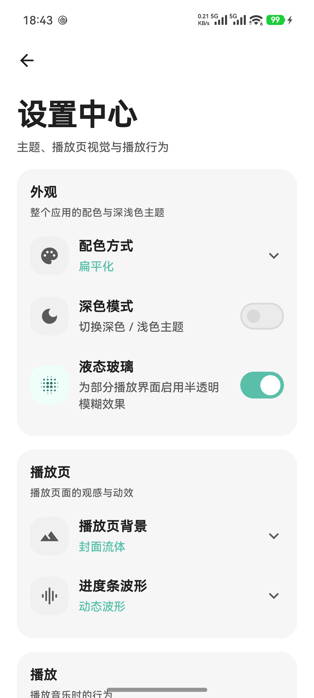
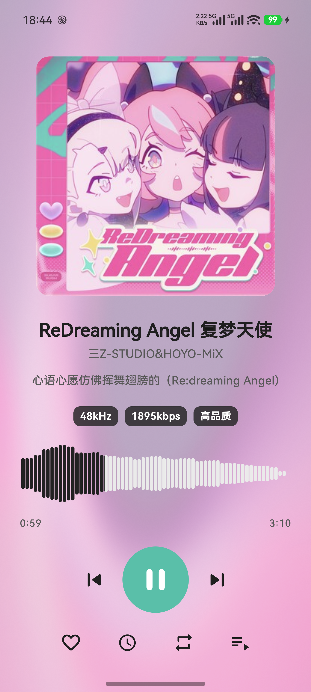
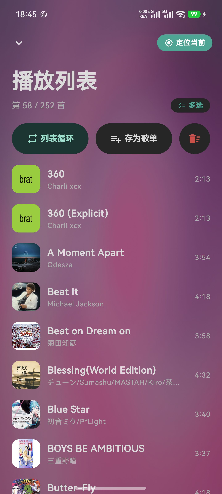
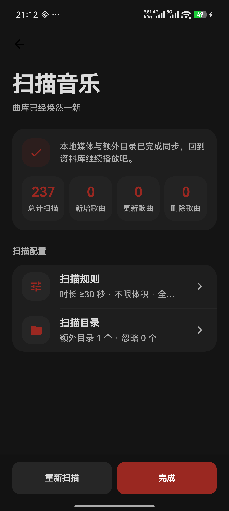
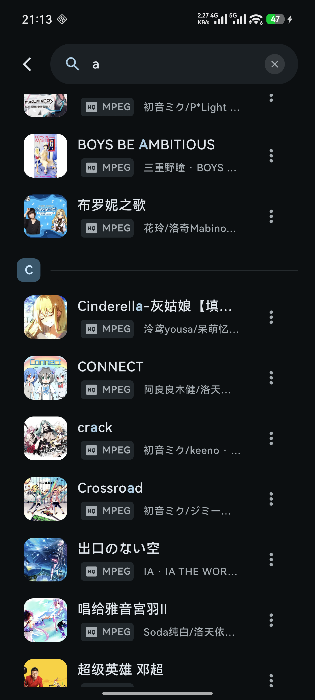
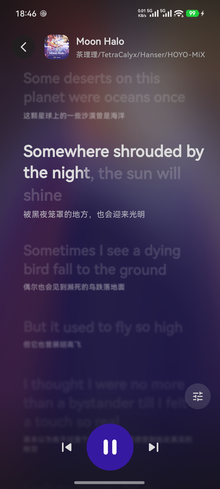

<div align="center">

# 柠檬音乐 · SPICa Music

**专注本地音乐播放的 Android 开源播放器**

多来源歌词 · 原生音频处理 · 动态视觉效果

[](LICENSE)
[](https://developer.android.com)
[](https://github.com/yangSpica27/SPICaMusic_Android/releases)

[下载 APK](https://github.com/yangSpica27/SPICaMusic_Android/releases) ·
[反馈问题](https://github.com/yangSpica27/SPICaMusic_Android/issues)

支持 Android 10（API 29）及以上，目前仅提供 `arm64-v8a` 架构。

</div>

## 核心特性

- **本地音乐库**：全库或指定文件夹扫描，按歌曲、专辑、艺术家浏览，支持收藏、歌单与播放历史。
- **多来源歌词**：内嵌歌词、本地文件导入与在线搜索，支持 LRC、YRC、AMLL/TTML 解析及时间偏移调整。
- **原生音频处理**：10 段均衡器、响度归一化与实时 FFT 频谱分析，基于 C++ Native DSP 实现。
- **动态界面**：亮暗主题、封面取色、动态背景与波形进度条。
- **日常播放**：后台播放、媒体通知、播放队列，以及顺序、随机和单曲循环模式。
- **多格式解码**：基于 Media3 与 FFmpeg，支持 FLAC、ALAC、Opus、MP3、AAC、WAV 等格式。

## 界面预览

亮色主题

<p align="center">
  
  
  
  
</p>

暗色主题

<p align="center">
  
  
  
  
</p>

## 技术与结构

使用 **Kotlin + Jetpack Compose** 构建界面，**Media3 ExoPlayer + MediaSession** 负责播放，搭配 Navigation 3、Koin、Room 与 DataStore。项目按音乐库、播放、歌词和设置拆分模块。

| 模块 | 职责 |
| --- | --- |
| `app` | 界面、ViewModel、后台播放服务与依赖装配 |
| `feature-*-domain` | 各功能的业务用例与统一入口 |
| `feature-*-data` | 音乐库、播放与歌词的数据实现 |
| `feature-player-native-dsp` | 原生均衡器、响度处理与频谱分析，见 [DSP 文档](feature-player-native-dsp/README.md) |
| `common` / `core-preferences` | 共享模型与偏好存储 |
| `baselineprofile` | Baseline Profile 生成与性能基准测试 |

## 从源码构建

准备 JDK 21、Android SDK 37，以及 Android SDK Manager 中的 NDK 和 CMake（3.22.1+）。Gradle 使用项目自带 Wrapper，插件版本见 [版本配置](gradle/libs.versions.toml)。

```bash
git clone https://github.com/yangSpica27/SPICaMusic_Android.git
cd SPICaMusic_Android
./gradlew :app:assembleDebug
```

Windows 使用 `gradlew.bat :app:assembleDebug`。生成的 APK 位于 `app/build/outputs/apk/debug/`。

> 构建会自动执行 `ktlintFormat`，可能修改 Kotlin 源码格式。

## 许可证

项目源码采用 [MIT License](LICENSE)。FFmpeg 解码器使用 [jellyfin-androidx-media](https://github.com/jellyfin/jellyfin-androidx-media/releases) 的预编译产物；FFmpeg 与其他第三方依赖遵循各自的许可证。
